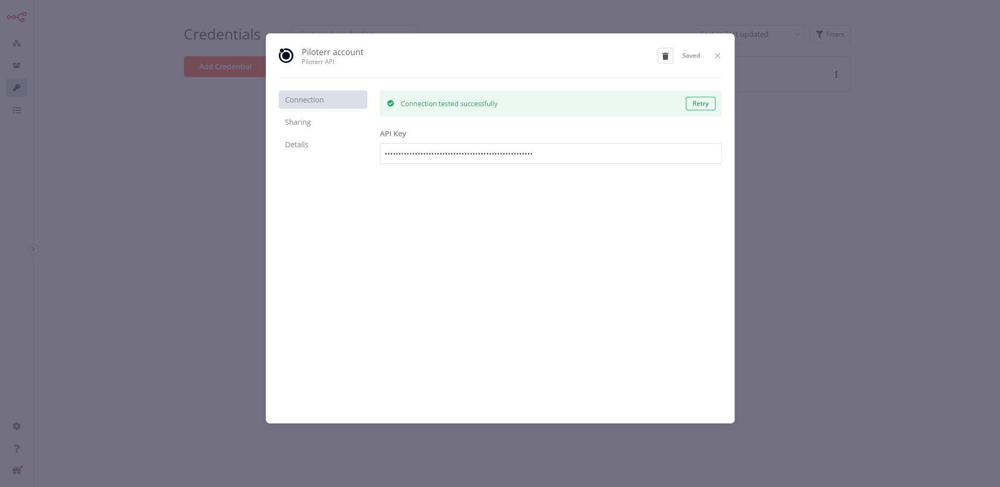

# n8n-nodes-_node-name_

This is an n8n community node. It lets you use Piloterr in your n8n workflows.

Piloterr API handles crawlers and rotates proxies for you.

[n8n](https://n8n.io/) is a [fair-code licensed](https://docs.n8n.io/reference/license/) workflow automation platform.

[Installation](#installation)  
[Operations](#operations)  
[Credentials](#credentials)
[Compatibility](#compatibility)  
[Usage](#usage) 
[Resources](#resources)  
[Version history](#version-history)

# Highlights
- [x] Company Database
- [x] Company Email Pattern
- [x] LinkedIn Company Info
- [x] LinkedIn Company Employee Count
- [x] LinkedIn Company Employee Info
- [x] LinkedIn Job Search
- [x] LinkedIn Job Info
- [ ] Instagram User Info
- [ ] Instagram Post
- [ ] Facebook Page Info
- [ ] Facebook Post

## Installation

Follow the [installation guide](https://docs.n8n.io/integrations/community-nodes/installation/) in the n8n community nodes documentation.

## Operations

_List the operations supported by your node._

## Credentials

This node require a token API in order to connect to your Piloterr account. You can get your token API from the [Piloterr](https://piloterr.com/login) website.

## Compatibility

I develop the node on n8n@0.211.0. I don't have the change to test on other versions yet.

## Usage

_This is an optional section. Use it to help users with any difficult or confusing aspects of the node._

_By the time users are looking for community nodes, they probably already know n8n basics. But if you expect new users, you can link to the [Try it out](https://docs.n8n.io/try-it-out/) documentation to help them get started._

## Resources

* [n8n community nodes documentation](https://docs.n8n.io/integrations/community-nodes/)
* [Piloterr website](https://piloterr.com/)
* [Piloterr pricing](https://piloterr.com/pricing)
* [Piloterr documentation](https://piloterr.com/docs)
* [Piloterr API documentation](https://piloterr.readme.io)

## Version history

- `0.0.1` - Initial release
